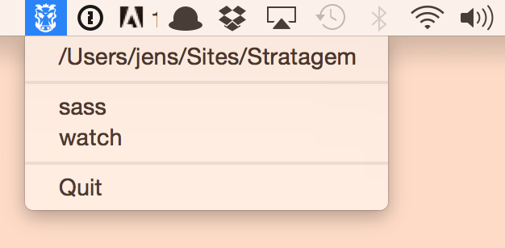

# Piglet [](https://travis-ci.org/jenslind/piglet) [](https://github.com/feross/standard)

> Run Grunt tasks from OS X menu bar.



Select your source dir and then run Grunt tasks from the menubar.

## Install
[Download](https://github.com/jenslind/piglet/releases/latest) and extract.

## Build
```
npm run build
```

## Test
```
npm test
```

## License
MIT
